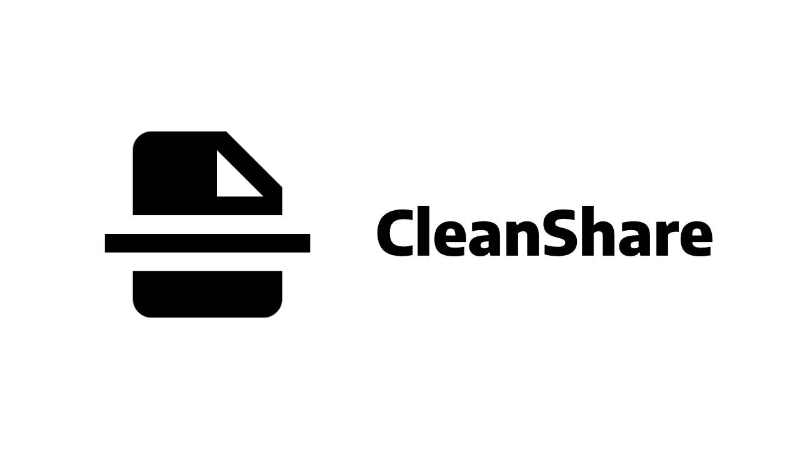

# CleanShare

<p align="center">
  
</p>

<p align="center">
  
</p>

An Android app that helps you rename files and remove metadata before sharing them. Protect your privacy by cleaning sensitive information from your files before distributing them.

## Screenshots

<p align="center">
  
  
  
</p>

<p align="center">
  
  
  
</p>

## Features

- **Rename Files**: Easily rename files with custom names before sharing
- **Remove Metadata**: Strip metadata from files to protect privacy
- **Simple Interface**: User-friendly design for quick file management
- **File Sharing Ready**: Clean and prepare files for safe sharing

## Prerequisites

- [Android Studio](https://developer.android.com/studio)
- Android SDK 21+

## Installation & Setup

1. Open Android Studio
2. Select **Open** and choose the directory containing this project
3. Allow Android Studio to fix any incompatibilities as it imports the project
4. If needed, update gradle dependencies
5. Run the app on an emulator or physical device

## Building

The project is built entirely in **Kotlin** and uses Gradle for dependency management.

```bash
./gradlew build
```

To run the app:

```bash
./gradlew installDebug
```

## How to Use

1. Launch the CleanShare app
2. Select a file from your device
3. Rename the file if desired
4. Remove metadata to clean sensitive information
5. Share the cleaned file securely

## Privacy Policy

This app does not collect, store, or share personal data beyond what is necessary for app functionality.

- Files selected by the user are processed locally on the device.
- Metadata removal and file renaming are performed on-device.
- The app does not upload files to any server.
- No personal information is knowingly collected from users.

For the full privacy policy, please visit: https://www.termsfeed.com/live/30406caa-8f69-4ecf-a5ec-c0eff8c648a9

## Project Structure

- `app/` - Main application module
- `src/main/kotlin/` - Kotlin source code
- `src/main/res/` - Android resources (layouts, drawables, strings)

## Technologies Used

- **Language**: Kotlin
- **Platform**: Android
- **Build System**: Gradle

## Contributing

Feel free to fork this project and submit pull requests for any improvements.

## Sources Used

- [Android Developer Documentation](https://developer.android.com/)
- [Kotlin Official Documentation](https://kotlinlang.org/)
- [Google AI Studio](https://ai.studio/)
